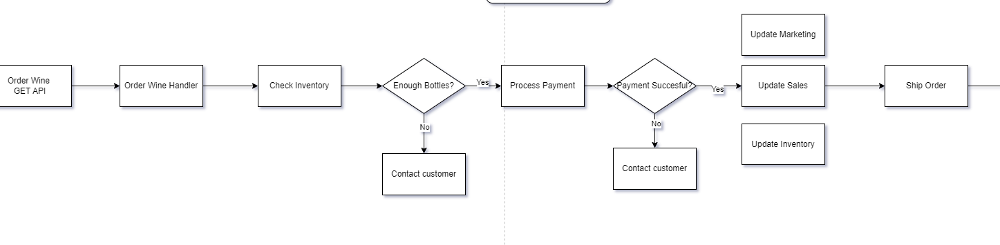
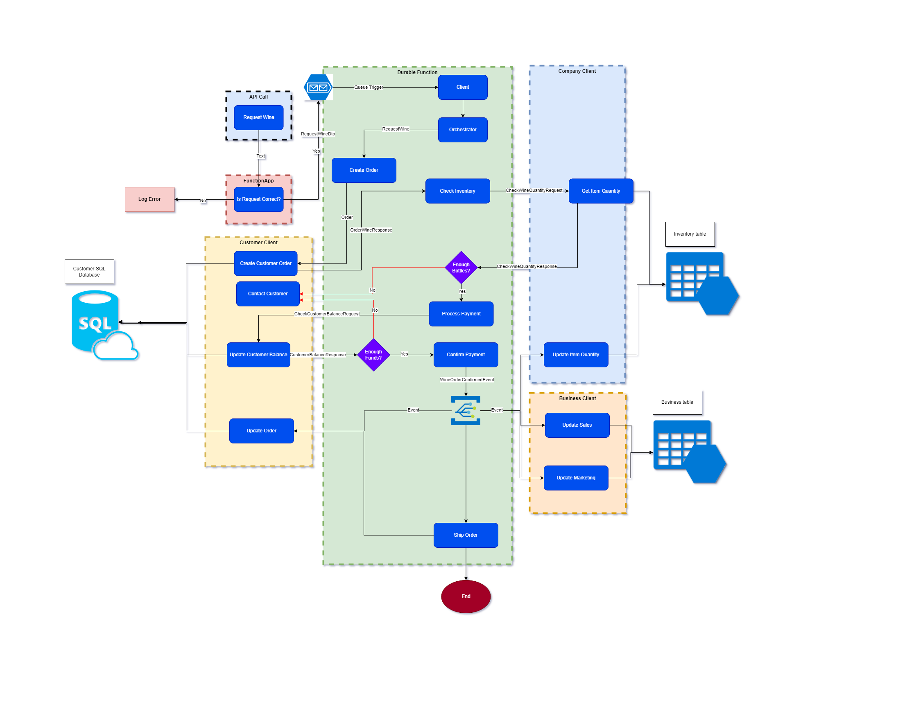
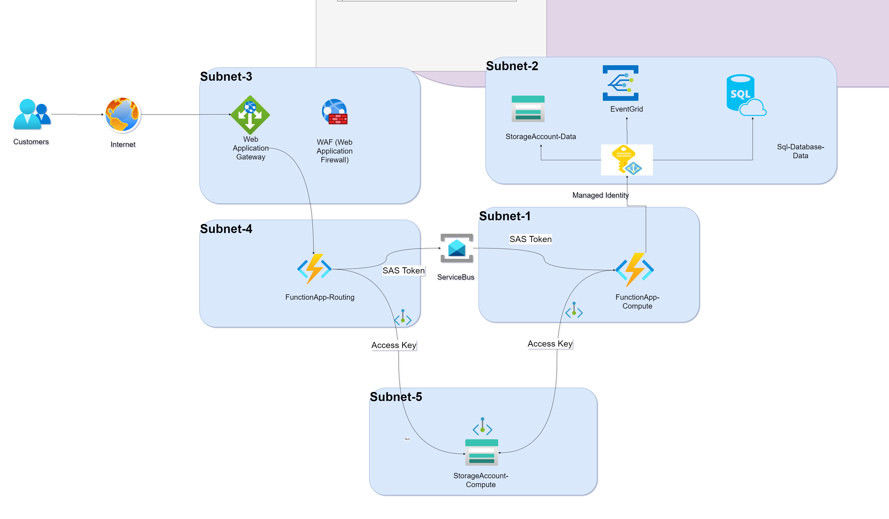
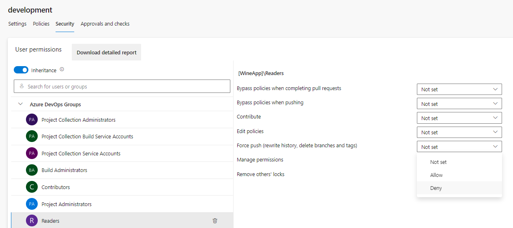
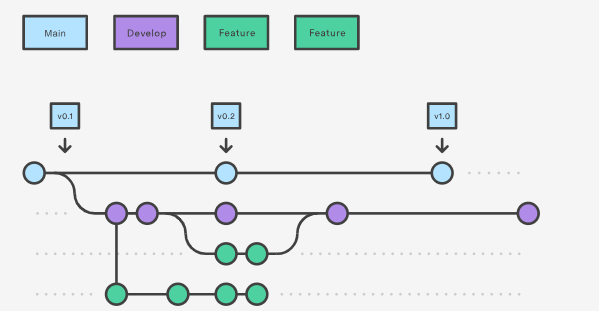

# Dionysos Application

## Introduction
Welcome To Dionysos, the online wine shop! Dionysos provides some of the best wines the world has to offer. Order fast, our items all have limited availability!

## Goal
The application will handle wine orders and update the stock accordingly. It will also update the business report and contact the customer when the product is shipped. The app will also handle customer orders at any time.
 

## Blogs
Here is a full documentation resulting from this project:

- [Deploying Azure Infrastructure in Terraform through a YAML Azure DevOps Pipeline](https://medium.com/@codebob75/terraform-in-azure-devops-pipeline-9a7e7dce2c05) 

- [Deploying .Net Code to a Function App using YAML files in Azure DevOps](https://medium.com/@codebob75/deploying-a-net-function-app-using-yaml-files-in-azure-devops-ec0b6c1e5484) 

- [AutoMapper dependency injection .Net 6](https://medium.com/@codebob75/automapper-dependency-injection-net-6-58a5c5314038) 

- [MediatR Dependency Injection .Net 6](https://medium.com/@codebob75/mediatr-dependency-injection-net-6-71c42ae7c0de) 

- [Leveraging Azure Service Bus with .NET 6 Dependency Injection in Function Apps](https://medium.com/@codebob75/servicebus-in-net-6-dependency-injection-function-app-2c72b05c6b78) 

## Functional Design

## Flow

## Infrastructure

## Terraform Pipeline

## Layers

## Requirements
[App requirements](https://www.altexsoft.com/blog/business/functional-and-non-functional-requirements-specification-and-types/) 

Functional Requirements:
- 'as $stock_manager, I need the app to check orders with my stock management tool before they can be confirmed"
- 'as $accounting_manager, I need the app to ensure the customer first pays before ordering"
- 'as $stock_manager, I need the app to update my stock once an order has been paid"
- 'as $sales_manager, I need the app to update my business report when an order has been paid"
- 'as $marketing_manager, I need the app to update my business report when an order has been paid"
- 'as $customer-service_manager, I need the app to create a new entry/update in my database for every new order"
- 'as $customer-service_manager, I need the app to contact the customer when there is not enough stock"
- 'as $customer-service_manager, I need the app to contact the customer when the payment fails"
- 'as $customer-service_manager, I need the app to contact the customer when the product is shipped"
- 'as $business-owner, I need the app to always handle customer orders at any time"

Non Functional Requirements:
- the app must be securely designed, all resources must be in a vnet
- the app must have a disaster recovery plan
- the app must be monitored and create alerts if critical treshholds are met
- the app must follow event-driven design and be loosely coupled
- the app must be able to scale to demand automatically

https://www.altexsoft.com/blog/non-functional-requirements/ 

## Architecture
The app is based on .Net, Azure and Azure DevOps. 
Here's a basic overview of the application
 

 
And here its functionality
 
And its flow
 

# Technical Part
## Project Planning

### Infrastructure choices
Logic apps offer several advantages for our use-case:
 
- Filter requests and start the process only if the request is valid (thus saving resources)
- [Low pricing per request](https://learn.microsoft.com/en-us/azure/logic-apps/logic-apps-pricing#consumption-pricing)
- [Ability to scale in case of increased demand](https://techcommunity.microsoft.com/t5/azure-integration-services-blog/scaling-logic-app-standard-for-high-throughput-scenarios/ba-p/3866731)
- [Monitoring & diagnostics](https://learn.microsoft.com/en-us/azure/logic-apps/monitor-logic-apps?tabs=consumption)
- [Out of the box connectors to other Azure services](https://learn.microsoft.com/en-us/connectors/connector-reference/connector-reference-logicapps-connectors)

 
The storage queue will then handle the requests, this enables features such as retry and finding unprocessed requests so that all orders can be processed in case of issues with the app or infra.

### Terraform Pipeline

- [Terraform State File](https://spacelift.io/blog/terraform-state) (Backend): One state file for each environment
- [Key concepts for new Azure Pipelines users](https://learn.microsoft.com/en-us/azure/devops/pipelines/get-started/key-pipelines-concepts?view=azure-devops)
- Git Ignore (vars)
- Dev & Main environment
- Service connection in ADO to create resources and access backend in Azure
- Ubuntu vs Windows images. Ubuntu images show better performance. This however influences the tool can be used in the pipeline (e.g. .Net testing tools)

# Execution Part

### Seting-up a Git Repo
- Git-init => Initialises an empty repo on your machine
- Go to Azure DevOps and create your project
- Push your local repo to Azure DevOps using your user name => git remote add origin https://firstname.surname@mail.com/gabrielpirastrutest/WineApp/_git/WineApp
- Then: git push -u origin --all
- git credential manager error: JavaScript is not supported or disabled in the browser you are using.
- Update credential-manager: dotnet tool update -g git-credential-manager
- Use the Git password from your project by clicking on 'generate git credentials'
- Create default gitignore file: dotnet new gitignore
- Git Ignore: add terraform gitignore before creating backend:  [Terraform Git Ignore Example](https://github.com/github/gitignore/blob/main/Terraform.gitignore)

### Branch Policies

Preventing Users (e.g. readers) from deleting branches

### Terraform Pipeline

First it is necessary to store the state file in a backend.

Why using a backend in Terraform?
The Terraform backend, a vital component of the Terraform workflow, is responsible for storing and managing infrastructure state. It stores the state remotely in Azure blob storage to facilitate collaboration, locking, versioning, and security.

- Security: Terraform backends store the state file remotely, preventing it from residing on local workstations or version control systems, enhancing Security.

- Concurrency and Locking: Backends provide a locking mechanism to prevent multiple users from simultaneously modifying the infrastructure, reducing the risk of conflicting changes.

- Collaboration: Remote backends enable team members to collaborate effectively and avoid the manual distribution of state files.

- State History and Versioning: Many backends support state versioning and history tracking, allowing users to review changes over time and revert to previous states.

- Security: Backends offer access control and encryption features to secure the state data, ensuring only authorised users can access or modify it.

Steps to create and use a terraform backend:
- Create a dedicated resource-group and storage account for test and production
- Enable Soft Delete (90 days)
- Disable public blob access???
- Create a container called tfstate (it will contain the backend)
- Add a delete Lock

Backend Documentation:

- [Create your resources with AZ command line](https://learn.microsoft.com/en-us/azure/developer/terraform/store-state-in-azure-storage?tabs=azure-cli)
- [Securing Terraform State in Azure](https://techcommunity.microsoft.com/t5/fasttrack-for-azure/securing-terraform-state-in-azure/ba-p/3787254)
- [Terraform on Azure Pipelines Best Practices](https://julie.io/writing/terraform-on-azure-pipelines-best-practices/)
- [Managing Terraform State in Azure: Best Practices for Multiple Environments](https://medium.com/@RockDevOps/managing-terraform-state-in-azure-best-practices-for-multiple-environments-c2f28bab2316)
- [Running Terraform in an Azure DevOps Pipeline: A Comprehensive Guide](https://medium.com/@RockDevOps/running-terraform-in-an-azure-devops-pipeline-a-comprehensive-guide-6f8b7b2a4d7f)
- [Azure DevOps Pipelines with Terraform and Stages](https://www.youtube.com/watch?v=d85-KD9stqc&list=PLKrQcL3oB-T12rhv0coVt-1qWsQ6L3rYV&index=3&t=24s)
- [Set up Backend (az storage accounts)](https://thomasthornton.cloud/2022/01/24/setting-up-azure-devops-to-begin-deploying-terraform-and-configuring-an-azure-storage-account-for-terraform-remote-state/)

Once the backend has been created, the storage account has to be securely configured.

Backend Security
- Connect to your backend using a Service-Principal (see next step)
- Encryption: Enable Azure Storage Service Encryption (SSE) 
- Access control: Implement role-based access control (RBAC) for your Azure Blob Storage using Azure Active Directory (Azure AD)
- Firewall: Limit access to the storage account by configuring a Service Principal
- Public network access: Enabled from selected virtual networks and IP addresses (e.g. your local IP for local testing)
- Network Routing: Internet routing
- Set Authentication method to Access key

Access Backend through Access Key in Keyvault??
- Setup a keyvault for dev and prd
- Store secret value in keyvault

[Backend accessed by SAS](https://www.ciraltos.com/remote-backend-state-with-terraform-and-azure-storage/)
 Create a SAS key => use it within tf
https://www.youtube.com/watch?v=mpoTI660_Yg 
https://www.ciraltos.com/remote-backend-state-with-terraform-and-azure-storage/ 

Fetch secret from pipeline, option 1
- Condition: user needs to have higher than contributor role in AD
- In access configuration, select 'vault access policy'
- Give service principal read and list access to keyvault
- Go to Pipelines > Library > create one for dev & prd > select 'Link secrets from kv as a variable > select subscription > select kv name > authorize
- Use referenced var 
[Assign an access policy](https://learn.microsoft.com/en-gb/azure/key-vault/general/assign-access-policy?WT.mc_id=Portal-Microsoft_Azure_KeyVault&tabs=azure-portal) 
[Assign an access policy in pipeline](https://learn.microsoft.com/en-us/azure/devops/pipelines/release/key-vault-in-own-project?view=azure-devops&tabs=portal) 

Access Backend through Access Key in Keyvault, option 2
- in keyvault, give service-principal User role (under Access control (IAM))
- Add key vault stage
- Store secret as environment variable named: $env:ARM_ACCESS_KEY=$(az keyvault secret show --name mybackendkey --vault-name mykeyvault --query value -o tsv)

[Fetch kv secrets in pipeline](https://learn.microsoft.com/en-us/azure/devops/pipelines/release/azure-key-vault?view=azure-devops&tabs=yaml) 

https://learn.microsoft.com/en-us/azure/devops/pipelines/release/azure-key-vault?view=azure-devops&tabs=yaml 

Once the backend has been securely setup, it is time to access it from Azure DevOps (ADO).

ADO will use what is called a Service Connection that will connect to a Service Principal (SP) in Azure.

What is a SP and why do you need it? 
- A SP is an identity that is used to perform tasks in Azure on behalf of our pipeline
- It is setup in Azure Active Directory (now Microsoft Entra ID) in app registration
- With it, the pipeline can connect to Azure and create/delete resources automatically

Advantages of SP:
- Non-Interactive Authentication: SP provides an automatic authentication to Azure without having to go through any logins
- Granular Permissions: every SP can be granted a granular scope of permission on a resource, resource-group or subscription level
- Long-Term Access: there won't be any tokens or password to update

A Service Principal will be automatically created when creating a service connection in ADO.

Creating a Service Connection in ADO:
- Project settings > Create service connection > azure resource manager > service principal > keep rg blank > enter a name > select 'grant access permission to all pipelines'
- e.g. Name in ADO: DionysosAzureServiceConnection
- e.g. Name in AAD: gabrielpirastrutest-WineApp-******** – MPN in AAD
- Assign the Storage Blob Data Contributor role in Azure Active Directory to the service principal used to connect ADO to the azure container where the backend is 

[How to Create an Azure Remote Backend for Terraform](https://gmusumeci.medium.com/how-to-create-an-azure-remote-backend-for-terraform-67cce5da1520)

Then, Install Terraform Extension
- Organization Settings > extensions > market place > search for terraform > select org > install

Now we can create the yaml pipeline, the terraform pipeline is made of 3 parts:

- the main file (azure-pipeline.yml) which is going to pass variables (e.g. dev or prd) and call the two other files
- the plan.yml file which will screen the terraform code for errors and create a plan terraform file
- the deploy.yml which will use the plan file to then deploy resources

Here is the organisation of the azure-pipeline.yml:
- trigger: upon pushing to the mentioned branch, the pipeline will automatically start (for the first time the trigger branch wont work)
- variables: we pass the service connection used in the pipeline and the backend configuration (please note the backend key is actually the name of backend file, the name is determined in the pipeline)
- pool: the OS of the VM (agents) that will run the pipeline. Can be either Ubuntu or Windows. It matters because Ubuntu is faster but Windows has tools that can be used in the pipeline that Ubuntu doesn't have. Also in Linux, file path are with \ whilst in windows they are with /

How a yml pipeline is organised:
- Each pipeline has a stage, which has agents, that run jobs, that contain steps, that have tasks
- stage > jobs > steps > tasks

- [Key concepts for new Azure Pipelines users](https://learn.microsoft.com/en-us/azure/devops/pipelines/get-started/key-pipelines-concepts?view=azure-devops)

How to ensure that a pipeline runs dev and prd differently and only if pushing to production?
- By adding an if statement: ${{ if eq(variables['Build.SourceBranch'], 'refs/heads/master')}}
- This will run this step only if the branch is named master (in this case)

How to ensure that a pipeline runs only if the previous step worked?
- By adding condition: succeeded('validate_terraform')

How to use separate files in a pipeline?
- In order to use another file (here plan.yml and deploy.yml) you can use template
- E.g. template: Terraform/plan.yml (Terraform is the name of the folder in the directory)

Now we can build our terraform plan.yml:

- pass-on the parameters dev or prd using parameters
- first: install  terraform (every terraform yml file needs to do so)
- second: initialise terraform (see init command)
- third: validate terraform (optional): checks if tf code is correct
- fourth: run plan (see plan command)
- fith: move plan.tf to artifact directory
- finally: publish plan.tf as an artifact

init command:
- Add the working directory where the main.tf is at (e.g. '$(System.DefaultWorkingDirectory)/Infrastructure')
- Add the backend configuration

plan command:
- Add the working directory where the main.tf is at (e.g. '$(System.DefaultWorkingDirectory)/Infrastructure')
- Add the name of the service connection
- command options: see command options plan

command options plan:
- -lock=false (so the agent running this tage doesn't lock the backend)
- -var-file="vars/${{parameters.env}}.tfvars" to provide the tfvars file, without it the pipeline won't proceed if you're using variables
- -out=$(System.DefaultWorkingDirectory)/Infrastructure/terraform.tfplan' to create the plan.tf file that will be saved to artifacts and used by the deploy stage

save artifact:
- After plan completes, archive the entire working directory, including the .terraform subdirectory created during init, and save it somewhere where it will be available to the apply step. A common choice is as a "build artifact" within the chosen orchestration tool.

Now we can build our terraform deploy.yml:

- For this stage we are using a [deployment job](https://learn.microsoft.com/en-us/azure/devops/pipelines/process/deployment-jobs?view=azure-devops)
- Deployment strategy: runOnce vs Canary vs rolling. The runOnce is the simplest deployment strategy and all steps are executed once (preDeploy, deploy, routeTraffic)
- enviroment: create an environment in ADO (Pipelines > environment) read more about [Deployment Environment](https://learn.microsoft.com/en-us/azure/devops/pipelines/process/environments?view=azure-devops)

- [Checkout](https://learn.microsoft.com/en-us/azure/devops/pipelines/repos/pipeline-options-for-git?view=azure-devops&tabs=yaml): if self, the repository will be cloned within the job
- download: 
-  artifact: Before running apply, obtain the archive created in the previous step and extract it at the same absolute path. This re-creates everything that was present after plan, avoiding strange issues where local files were created during the plan step
- install terraform
- run terraform apply

Command options terraform apply:
-  -lock=true we want to lock the backend
- -lock-timeout=5m we want to realse the backend after the step has been run
- $(Pipeline.Workspace)/output-${{ parameters.env }}/Infrastructure/terraform.tfplan'

Tips to help you build terraform yaml:
- Use templates: in ADO go to Repo > Set up build > show assistant > get terraform suggestions, then get the yaml code and copy it in a .yml file
- Give a custom name to your pipeline: [Name of the pipeline](https://learn.microsoft.com/en-us/azure/devops/pipelines/process/run-number?view=azure-devops&tabs=yaml)
- Select the right [Agent Pool](https://learn.microsoft.com/en-us/azure/devops/pipelines/agents/pools-queues?view=azure-devops&tabs=yaml%2Cbrowser)
- How to set up [Triggers](https://learn.microsoft.com/en-us/azure/devops/pipelines/process/pipeline-triggers?view=azure-devops). trigger can be a branch (e.g. branches: include: -name of branch) or a folder (e.g. paths: include: -name of folder)
- Build the step [validate](https://spacelift.io/blog/terraform-validate)
- Move the terraform plan to an artifiact as specified by [hashicorp documentation](https://developer.hashicorp.com/terraform/tutorials/automation/automate-terraform)
- apply in a [deployment job](https://learn.microsoft.com/en-us/azure/devops/pipelines/process/deployment-jobs?view=azure-devops)
- [Automated Terraform CLI Workflow](https://developer.hashicorp.com/terraform/tutorials/automation/automate-terraform?utm_source=WEBSITE&utm_medium=WEB_IO&utm_offer=ARTICLE_PAGE&utm_content=DOCS)
- Edit system environment variables > environment variables > path > new > add path where terraform is at > new command line

Solving error:
Error while loading schemas for plugin components: Failed to obtain
│ provider schema: Could not load the schema for provider
│ registry.terraform.io/hashicorp/azurerm: failed to instantiate provider
│ "registry.terraform.io/hashicorp/azurerm" to obtain schema: fork/exec
│ .terraform/providers/registry.terraform.io/hashicorp/azurerm/3.72.0/linux_amd64/terraform-provider-azurerm_v3.72.0_x5:
│ permission denied..

Solution for ADO
- using Ubuntu agents, (linux uses '/' instead of '\'), Terraform couldn't find the file. Switching to the correct agent (in my case Windows) solved it

Solution locally
- [hashicorp_documentation](https://support.hashicorp.com/hc/en-us/articles/4409220280339-Error-Could-not-load-plugin-permission-denied-or-exec-format-error)
- In your terraform folder run the following command to find your permissions: ls -l .terraform\providers\registry.terraform.io\hashicorp\azurerm\3.72.0\windows_386 
- Then run the PowerShell command to setup permissions: icacls .terraform\providers\registry.terraform.io\hashicorp\azurerm\3.72.0\windows_386
- Solution in pipeline = give the service principal, in Azure AD app registration, contributor rights to the backend blob container

Giving permissions to the environment
- Checks and manual validations for deploy Terraform: Permission Environment <nameofenv> permission needed: permit ==> Granting permission here will enable the use of Environment 'deploy_infrastructure_prd' for all waiting and future runs of this pipeline. ==> Permission granted

Error: deleting Resource Group "dionysos-rg-dev": the Resource Group still contains Resources.
- Add 
│ provider "azurerm" {
│   features {
│     resource_group {
│       prevent_deletion_if_contains_resources = false
│     }
│   }
│ }

### Azure Infrastructure

Azure Infrastructure Documentation
- [Function app networking](https://learn.microsoft.com/en-us/azure/azure-functions/functions-create-vnet)
- [What is a private Azure DNS zone](https://learn.microsoft.com/en-us/azure/dns/private-dns-privatednszone)
- [Private Endpoint](https://hovermind.com/azure-fundamentals/advanced-concepts.html)
- [Serverless architecture](https://learn.microsoft.com/en-us/azure/architecture/serverless-quest/reference-architectures)
-[Serverless Reference architecture](https://github.com/azure-samples/serverless-microservices-reference-architecture/blob/main/documentation/introduction.md)

#### Networking

Virtual network & subnets CIDR basics
- Azure keeps 5 addresses for each subnet
- Address space (CIDR block), /29 (10.1.0.0/29) provides 8 address (minus 5)
- Bit format: 128 64 32 16 8 4 2 1 (max 255)

Virtual network & subnets CIDR calculation example
- Address format example: 10.1.0.0 (in octet)
- Adress format is in octet (8 bits), so each number represents 0000 0000

1st/ translate into bits
- 10.1.0.0 translated into octet bits = 00001010.00000001.00000000.00000000 
- e.g. First Octet: 00001010 (in binary, equivalent to 10 in decimal)

2nd/ check the remainder
- Now that we have the bits, let's use the /number, here /29, meaning that the first 29 numbers are the same
- So 00001010.00000001.00000000.00000 taken and 000 remaining, 000 in bit is 4+2+1 = 7, minus 5 (taken by azure)

3rd/ Get the range
- So we have a 10.1.0.7, giving a range of 10.1.0.0-10.1.0.7 => 8 addresses (minus 5)

[Understanding CIDR Notation](https://devblogs.microsoft.com/premier-developer/understanding-cidr-notation-when-designing-azure-virtual-networks-and-subnets/#:%7E:text=The%20second%2C%20and%20most%20important,which%20provides%20eight%20IP%20addresses)

Virtual network CIDR
- ["10.0.0.0/16"] provides us with 256 x 256 = 65,536 unique IP addresses (minus 5)

Subnet CIDR
- Considering the previous CIDR calculation, subnets are portions of the above mentioned subnet.
- We will thus cut two subnets: ["10.0.1.0/24"] and ["10.0.2.0/24"]
- Subnet 1: 10.0.1.1 to 10.0.1.255 (256 minus 5) = 251 possible addresses
- Subnet 2: 10.0.2.1 to 10.0.2.255 (256 minus 5) = 251 possible addresses

- Service bus endpoint

https://learn.microsoft.com/en-us/azure/service-bus-messaging/service-bus-service-endpoints 

#### Security

Data Flow:

- HTTP/HTTPS requests first hit the Application Gateway 
- The request is first served and checked by a functionApp
- The request is then processed through a ServiceBus
- The ServiceBus triggers another function app
- This function app updates data in a separate storage and creates an event
- This event is handled by EventGrid

[Securely managed web applications](https://learn.microsoft.com/en-us/azure/architecture/example-scenario/apps/fully-managed-secure-apps)
[Reliable web app pattern for .NET - Apply the pattern](https://learn.microsoft.com/en-us/azure/architecture/web-apps/guides/reliable-web-app/dotnet/apply-pattern)

- Security baselines for Azure

Security baselines are standardized documents for Azure product offerings, describing the available security capabilities and the optimal security configurations to help you strengthen security through improved tooling, tracking, and security features.

[Security baselines for Azure](https://learn.microsoft.com/en-us/security/benchmark/azure/security-baselines-overview)

Security components:
- Application Gateway

An application gateway is a dedicated deployment in your virtual network. Within your virtual network, a dedicated subnet is required for the application gateway.
Although a /24 subnet isn't required per Application Gateway v2 SKU deployment, it is highly recommended. This is to ensure that Application Gateway v2 has sufficient space for autoscaling expansion and maintenance upgrades

How can you protect your services?
- Deploy Azure Web Application Firewall (WAF) withApplication Gateway WAF v2 SKU to protect against L7 application layer attacks.

[Virtual network and dedicated subnet](https://learn.microsoft.com/en-us/azure/application-gateway/configuration-infrastructure)
[Azure security baseline for Azure Web Application Firewall](https://learn.microsoft.com/en-us/security/benchmark/azure/baselines/azure-web-application-firewall-security-baseline?toc=%2Fazure%2Fweb-application-firewall%2Ftoc.json)

[Service Bus authentication and authorization](https://learn.microsoft.com/en-us/azure/service-bus-messaging/service-bus-authentication-and-authorization)
[Network security Azure Service Bus namespace](https://learn.microsoft.com/en-us/azure/service-bus-messaging/service-bus-ip-filtering)

[Application gateway with URL path-based redirection](https://learn.microsoft.com/en-us/azure/application-gateway/tutorial-url-redirect-cli)
[Deploy an Azure Application Gateway v2 using Terraform to direct web traffic](https://learn.microsoft.com/en-us/azure/developer/terraform/deploy-application-gateway-v2)

[Configure Azure Application Gateway components](https://learn.microsoft.com/en-us/training/modules/configure-azure-application-gateway/4-app-gateway-components)

Network Security Groups?
delegation 
 service_delegation
 private DNS zone
 https://azure-training.com/2021/08/17/understand-and-configure-azure-private-dns-zone-for-custom-domain-names/ 

 - Subnet Delegation with endpoints

 https://learn.microsoft.com/en-us/azure/virtual-network/subnet-delegation-overview 
 No need of delegation when using private endpoints

-  A private DNS zone with endpoints

To secure access to storage account over private internal network.
We need to access the private endpoint (PE) through a fully qualified domain name (FQDN).
A private endpoint is just another virtual network interface card (NICK) added to the subnet, which gets a private IP.
Now we can access the resource by calling this IP in the private virtual network.
A PE binds to a sub-resource(file, blob, table, queue, web or dfs) and not to the whole storage account.
A PE needs a vnet and subnet.
Needs to integrate with private DNS Zone
Advantage of private DNS Zones: not having to manually update DNS
Goal: resolve DNS names for private endpoints from any location in vnet without having to update DNS

When you’re connecting to a private link resource using a fully qualified domain name (FQDN) as part of the connection string, it’s important to correctly configure your DNS settings to resolve to the allocated private IP address. Existing Microsoft Azure services might already have a DNS configuration to use when connecting over a public endpoint. This configuration needs to be overridden to connect using your private endpoint.

The network interface associated with the private endpoint contains the complete set of information required to configure your DNS, including FQDN and private IP addresses allocated for a particular private link resource.

 [Private Endpoints and DNS in Azure](https://www.ciraltos.com/private-endpoints-and-dns-in-azure/)

 [Azure Private Endpoint DNS configuration](https://learn.microsoft.com/en-us/azure/private-link/private-endpoint-dns)

Manages an App Service Virtual Network Association for Regional VNet Integration.
This resource can be used for both App Services and Function Apps.
 https://registry.terraform.io/providers/hashicorp/azurerm/latest/docs/resources/app_service_virtual_network_swift_connection 

 A private DNS zone is used to resolve the private IP addresses of these services within your virtual network. 
 It provides name resolution for resources in a private network. 
 When you use a private endpoint, the private DNS zone helps resolve the service's domain name to its private IP address, enabling seamless communication within the virtual network.

 - Managed Identity:  [User assigned](https://learn.microsoft.com/en-us/azure/active-directory/managed-identities-azure-resources/how-manage-user-assigned-managed-identities?pivots=identity-mi-methods-azp)

 #### Compute

Logic App
- Consumption Tier (pay per execution, only one workflow, ISE enables auto-scaling)
- Integration Service environment  (ISE) is a fully isolated and dedicated environment for all enterprise-scale integration needs.
- Stateful workflows: save input/output and save state in external storage, which makes history possible whilst providing  high resiliency if outages happen

[Logic apps](https://www.serverless360.com/blog/tips-and-tricks-13-logic-app-standard-vs-consumption)
[Logic app in Terraform](https://techcommunity.microsoft.com/t5/azure-integration-services-blog/deploy-logic-app-standard-with-terraform-and-azure-devops/ba-p/3807734)
- TO DO: Logic-app workflow in terraform? ==> https://stackoverflow.com/questions/70757669/logic-apps-workflows-via-terraform-and-azure
Logic app in network = https://medium.com/@moskv08/how-to-integrate-an-azure-logic-app-into-a-virtual-network-with-out-an-ise-75b6608d3007

Function App
- When creating an Azure Functions App, a dedicated storage account is also created, the Functions App relies on the storage for various operations such as trigger management and logging. By default, this account is created with “Allow storage account key access” enabled.

Plan pricing tiers => https://azure.microsoft.com/en-us/pricing/details/app-service/windows/ 

[Azure Functions Consumption Dynamic](https://learn.microsoft.com/en-us/azure/azure-functions/consumption-plan)

Resource group

#### Data

- Storage
When creating a logic app, you must create or link to an external storage, which is used to store workflow state, run history, and artifacts.
[Using Private Endpoint in Azure Storage Account with Terraform](https://gmusumeci.medium.com/using-private-endpoint-in-azure-storage-account-with-terraform-49b4734ada34)

ServiceBus

- Service Bus NameSpace

[create a Service Bus namespace](https://learn.microsoft.com/en-us/azure/service-bus-messaging/service-bus-quickstart-portal)
- Service Bus Queue [Service Bus queues](https://learn.microsoft.com/en-us/azure/service-bus-messaging/service-bus-queues-topics-subscriptions)

Queues offer First In, First Out (FIFO) message delivery to one or more competing consumers. That is, receivers typically receive and process messages in the order in which they were added to the queue. And, only one message consumer receives and processes each message.

- Service Bus Topic
 queue allows processing of a message by a single consumer. In contrast to queues, topics and subscriptions provide a one-to-many form of communication in a publish and subscribe pattern.

EventGrid

- [What is Azure Event Grid?](https://learn.microsoft.com/en-us/azure/event-grid/overview)

## .Net Code

### .Net Pipeline

- [Build, test, and deploy .NET Core apps](https://learn.microsoft.com/en-us/azure/devops/pipelines/ecosystems/dotnet-core?view=azure-devops&tabs=dotnetfive)

### Clean Architecture Pattern

[Follow the clean architecture](https://jasontaylor.dev/clean-architecture-getting-started/)

### Starter

The role of the function app will be to respond to http requests that will then send messages to the Service Bus client.

Here's what we will build:

- Create a class project and add a class that represents the message that will be sent to the http function
- Create a separate project where the Client to Azure Service Bus will be at
- Build the http FunctionApp using the servicebus client
- Inject the client in the http function

#### ServiceBus Client

- Building the client

The Client that we will be using is the ServiceBusClient and also the ServiceBusSender.
To construct the ServiceBusClient we need a connection string, this will be injected in the constructor using IOptions.

[AZURE SERVICE BUS .NET SDK DEEP DIVE – SENDING A MESSAGE](https://www.planetgeek.ch/2020/03/11/azure-service-bus-net-sdk-deep-dive-sending-a-message/)
[Azure Service Bus and C# - an introduction](https://www.code4it.dev/blog/azure-service-bus-introduction/)

- Building the Http Triggered Function App

Creating a Function App with an HTTP trigger is an essential and powerful way to build serverless applications and microservices in the Azure cloud. Azure Functions allows developers to execute small pieces of code in response to various events, such as HTTP requests, without the need to manage infrastructure

[Azure Functions HTTP trigger](https://learn.microsoft.com/en-us/azure/azure-functions/functions-bindings-http-webhook-trigger?tabs=python-v2%2Cisolated-process%2Cnodejs-v4%2Cfunctionsv2&pivots=programming-language-csharp)

- Building the Http Triggered Function App

### Dependency Injection ServiceBus

- Use Dependency Injection in the Function App to make use of the client

The ServiceBusClient, senders, receivers, and processors are safe to cache and use as a singleton for the lifetime of the application, which is best practice when messages are being sent or received regularly. 
They are responsible for efficient management of network, CPU, and memory use, working to keep usage low during periods of inactivity.
[Azure Service Bus client library for .NET - version 7.16.1](https://learn.microsoft.com/en-us/dotnet/api/overview/azure/messaging.servicebus-readme?view=azure-dotnet)
[Use dependency injection in .NET Azure Functions](https://learn.microsoft.com/en-us/azure/azure-functions/functions-dotnet-dependency-injection)
[How To Setup Dependency Injection With Azure Functions ⚡](https://www.rahulpnath.com/blog/dependency-injection-in-azure-functions/)

When creating the client, add a constructor, with the libraries from Microsoft (ServiceBusSender and IOptions<AzureServiceBusOptions>), we will then create the ServiceBusClient with 
the ServiceBusConnection string that will reside in the AzureServiceBusOptions, this latter will be injected in the StartUp with Configuration.

What is a ServiceBusClient? The ServiceBusClient is the top-level client through which all Service Bus entities can be interacted with. Any lower level types retrieved from here, such as ServiceBusSender and ServiceBusReceiver 
will share the same AMQP connection. [ServiceBusClient Class](https://learn.microsoft.com/en-us/dotnet/api/azure.messaging.servicebus.servicebusclient?view=azure-dotnet)

[Azure.Messaging.ServiceBus samples for .NET](https://learn.microsoft.com/en-us/samples/azure/azure-sdk-for-net/azuremessagingservicebus-samples/?source=recommendations)
[Quickstart: Send and receive messages from an Azure Service Bus queue (.NET)](https://learn.microsoft.com/en-us/azure/service-bus-messaging/service-bus-dotnet-get-started-with-queues?tabs=passwordless)
[exercise-write-code-that-uses-service-bus-queues](https://learn.microsoft.com/en-us/training/modules/implement-message-workflows-with-service-bus/5-exercise-write-code-that-uses-service-bus-queues)
- Why an AMQP connection?

First off, what is an AMQP connection? The Advanced Message Queuing Protocol is a messaging protocol that enables conforming client applications to communicate with conforming messaging middleware brokers.
[AMQP 0-9-1 Model Explained](https://www.rabbitmq.com/tutorials/amqp-concepts.html)
AMQP is the most efficient, because it maintains the connection to Service Bus. 
It also implements batching and prefetching. Unless explicitly mentioned, all content in this article assumes the use of AMQP or SBMP.
[Best Practices for performance improvements using Service Bus Messaging](https://learn.microsoft.com/en-us/azure/service-bus-messaging/service-bus-performance-improvements?tabs=net-standard-sdk-2)

Why do we need IOptions? The options pattern uses classes to provide strongly typed access to groups of related settings. When configuration settings are isolated by scenario into separate classes, 
the app adheres to two important software engineering principles:
Encapsulation:
Classes that depend on configuration settings depend only on the configuration settings that they use.
Separation of Concerns:
Settings for different parts of the app aren't dependent or coupled to one another.

In our example, we are using the IOption to use the AzureServiceBusOptions which contains our ConnectionString
[Options pattern in ASP.NET Core](https://learn.microsoft.com/en-us/aspnet/core/fundamentals/configuration/options?view=aspnetcore-7.0)

Why do we need the AzureServiceBusOptions? This is where we will indicate the Connection String of the ServiceBus, you can find this latter under > ServiceBus NameSpace > Shared Access Policy
> RootManageSharedAccessKey (or add another one if needed) > copy the Primary Connection String

- Environment variables
This is where you will paste the Primary Connection String of your ServiceBus. For working and testing locally, create a local.settings.json
App settings can be read from environment variables both when developing locally and when running in Azure. When developing locally, app settings come from the Values collection in the local.settings.json file. 
In both environments, local and Azure, GetEnvironmentVariable("<app setting name>") retrieves the value of the named app setting.
[Environment variables](https://learn.microsoft.com/en-us/azure/azure-functions/functions-dotnet-class-library?tabs=v4%2Ccmd#environment-variables)

- Getting Secret from Configuration

Configuration in .NET is performed using one or more configuration providers. Configuration providers read configuration data from key-value pairs using various configuration sources:

Settings files, such as appsettings.json
Environment variables
Azure Key Vault
Azure App Configuration

[.NET Configuration In Depth | .NET Conf 2022](https://www.youtube.com/watch?v=1aNMO2cBmv0)
[Configuration providers in .NET](https://learn.microsoft.com/en-us/dotnet/core/extensions/configuration-providers)
[Configuration in .NET](https://learn.microsoft.com/en-us/dotnet/core/extensions/configuration)

With the configuration set in our Startup.cs file we can use it to pass our ConnectionString that resides in our local.appsettings.json to our AzureServiceBusOptions which in turn
will be used in our client using options.

Once configuration is set, you can access it using configuration[key]
The key here is serviceBusConnectionString "serviceBusConnectionString": "xxxxxxxxxxxxx"
You can also access it in your class using a private const string serviceBusConnectionStringVar = "serviceBusConnectionString";
And then refer to it directly in your configuration[serviceBusConnectionStringVar]

- Dependency Injection Process

1/ Service Registration = we register (i.e. add) our services to the container (IServiceCollection) by doing  services.AddScoped<IMyService, MyService>();
2/ Building the Service Provider (SP) = we create an instance of the SP that manages the lifetime of the container
3/ Service Resolution = when interfaces and classes get bounded together

- What is a container in dependency injection?

Basically, the container is where we bind all the loosely coupled parts of our application.
An object that knows how to instantiate and configure objects and all their dependent objects.

In the context of dependency injection (DI), a "container" refers to a specialized software component that manages the instantiation and lifetime of objects (usually referred to as "services" or "dependencies") in an application. Containers are a key component of the dependency injection pattern and are used to facilitate the injection of dependencies into various parts of an application, such as classes, components, or controllers, without requiring the developer to manually create and manage these dependencies.

- What does GetRequiredService() do? 
Basically it fetches the service that you added previously.
So builder.Services.AddSingleton<IConfiguration> can be found using var configuration = serviceProvider.GetRequiredService<IConfiguration>();

- How to configure a secret/ connection string in Dependency Injection?
Instead of using builder.Services.Add... use the builder.Services.Configure

## Getting Setting values for dev and prod

In order to do this, we need to use the IConfiguration configuration in the constructor.
Then to refer to a variable in the local setting (e.g. "ApplicationName": "BobIsYourUncle") you can do two things;

- Either refer to it directly using a string: configuration["ApplicationName"]
- Or create a private const string ApplicationNameVar = "ApplicationName" and refer to it by doing so configuration[ApplicationName]

#### Serialise Service Bus Message

ServiceBusMessage takes in a body that is of type BinaryData and we want to send a message of type class with properties.

[Azure.Messaging.ServiceBus](https://github.com/Azure/azure-sdk-for-net/blob/main/sdk/servicebus/Azure.Messaging.ServiceBus/samples/Sample01_SendReceive.md)
[Azure ServiceBus Message Serialization/Deserialization](https://stackoverflow.com/questions/50710568/azure-servicebus-message-serialization-deserialization)

Errors:

null exception

Solution:
make sure that the message has the MessageId and CorrelationId filled in

Errors

 Microsoft.Azure.ServiceBus: The lock supplied is invalid. Either the lock expired, or the message has already been removed from the queue. 

## Deploying the Function App

### .Net Pipeline

The DotNet Pipeline is part of the Continuous Delivery Process during which code is built, tested, and deployed to one or more test and production environments. Deploying and testing in multiple environments increases quality.
Deploying a .NET Function App using YAML files in Azure DevOps is a streamlined and efficient way to automate the deployment process of your serverless functions.
Azure DevOps, in combination with YAML configuration files, empowers you to define the deployment steps, dependencies, and configurations as code, making it easier to maintain and reproduce deployments. In this process, you can manage the entire lifecycle of your .NET Function App, from building and packaging your functions to deploying them seamlessly to the Azure cloud. This approach provides greater control, reliability, and scalability for your serverless applications, ensuring they're ready to serve your users and customers without manual intervention.
[What is Azure Pipelines?](https://learn.microsoft.com/en-us/azure/devops/pipelines/get-started/what-is-azure-pipelines?view=azure-devops)

[Continuous delivery with Azure Pipelines](https://learn.microsoft.com/en-us/azure/azure-functions/functions-how-to-azure-devops?tabs=csharp%2Cyaml&pivots=v1)
[dotnet build](https://learn.microsoft.com/en-us/dotnet/core/tools/dotnet-build)
[DotNetCoreCLI@2 - .NET Core v2 task](https://learn.microsoft.com/en-us/azure/devops/pipelines/tasks/reference/dotnet-core-cli-v2?view=azure-pipelines)
[How to build DotNet in Azure DevOps](https://ciemasen.com/articles/how-to-build-dotnet-in-azure-devops)

- Build vs Release Pipeline
The build pipeline is meant to produce the binaries (such as executing commands like 'dotnet publish' or 'ng build - prod') as an artifact, stored in a file that the release pipeline will then download and use and deploy.
The rationale behind maintaining separate build and release pipelines is to ensure that a specific version of software is built only once, and then these identical binaries could be used across various target environments, such as development, testing, and production.
The release pipeline on the other hand will deploy the artifact that has been created by the build pipeline to the given function app.

- Build Pipeline Steps:

#1 Get the correct dotnet version of your project

First we need to install the dotnet version onto which the project run, you can run dotnet - info to find out which version you are using.

#2 Build the Project 

Run the build command to compile the .NET project.
The dotnet build command builds the project and its dependencies into a set of binaries. The binaries include the project's code in Intermediate Language (IL) files with a .dll extension.

[Build .net core 6 projects with Azure Devops using yml files](https://briancaos.wordpress.com/2022/09/22/build-net-core-6-projects-with-azure-devops-using-yml-files/)
[dotnet build](https://learn.microsoft.com/en-us/dotnet/core/tools/dotnet-build)

What does Build do? 
1/ The compiler launches, it first restores all required dependencies through the Nuget Package Manager.
2/ Then the command-line tool compiles the project and stores its output in a folder called "bin" (Debug or Release)
3/ At this point the C# Code has been compiled into an executable file containing the Common Intermediate Language (CIL) Code - Assembly Level
4/ For the OS to run the CIL it needs to be converted into native code which is done by the Common Language Runtime

[How is C# Compiled?](https://freecontent.manning.com/how-is-c-compiled/)

#3 Restore dependencies
Ensures that your project's dependencies are correctly resolved and downloaded
With NuGet Package Restore you can install all your project's dependency without having to store them in source control. This allows for a cleaner development environment and a smaller repository size. You can restore your NuGet packages using the NuGet restore task, the NuGet CLI, or the .NET Core CLI

[Restore NuGet packages with Azure Pipelines](https://learn.microsoft.com/en-us/azure/devops/pipelines/packages/nuget-restore?view=azure-devops&tabs=classic)

What dependencies does the command restore?
Dependency Resolution: .NET projects typically rely on various external libraries and packages (NuGet packages in the case of .NET). These dependencies are listed in your project file (e.g., .csproj file) as references. When you run dotnet restore, it scans the project file, fetches the necessary dependencies, and makes them available for use in your project. This ensures that the correct versions of these packages are available.

The 'restore' command is used to restore NuGet packages referenced by the specified project(s). 
It ensures that the required packages are downloaded and restored to the project's packages directory.

[DotNetCoreCLI@2 - .NET Core v2 task](https://learn.microsoft.com/en-us/azure/devops/pipelines/tasks/reference/dotnet-core-cli-v2?view=azure-pipelines)

dotnet restore - Restores the dependencies and tools of a project.

[dotnet restore](https://learn.microsoft.com/en-us/dotnet/core/tools/dotnet-restore)

The dotnet build command builds the project and its dependencies into a set of binaries. The binaries include the project's code in Intermediate Language (IL) files with a .dll extension. 
The C# compilation process has three states (C#, Intermediate Language, and native code) and two stages: going from C# to Common Intermediate Language and going from Intermediate Language to native code.

#4 Publish
The "publish" command is used to prepare the project for deployment by generating publishable output files.
sets the build configuration to "Release" and specifies the output directory as the "$(Build.ArtifactStagingDirectory)." This means the publish output will be placed in a location that Azure DevOps uses for staging artifacts.
zipAfterPublish: true: If this input is set to "true," it will compress the folders created by the publish command into a zip file. This can be useful for packaging the published artifacts into a single archive.
[dotnet publish](https://learn.microsoft.com/en-us/dotnet/core/tools/dotnet-publish)

#5 Publish artifacts 
So that we can use them at the release stage
dotnet publish - Publishes the application and its dependencies to a folder for deployment to a hosting system.

[dotnet publish](https://learn.microsoft.com/en-us/dotnet/core/tools/dotnet-publish)

DotNetCoreCLI@2 > publish

In a pipeline we use the DotNetCoreCLI@2 - .NET Core v2 task which can Build, test, package, or publish a dotnet application, or run a custom dotnet command.

What are Artifacts?
[Artifacts in Azure Pipelines](https://learn.microsoft.com/en-us/azure/devops/pipelines/artifacts/build-artifacts?view=azure-devops&tabs=yaml)

Error:

/DotNetPipeline/Build.yml (Line: 1, Col: 1): Unexpected value 'pool'
/DotNetPipeline/Build.yml (Line: 4, Col: 1): Unexpected value 'steps'

Solution:
The pool and steps sections should be inside a job definition.

Error: 
Stage deploy_dotnet must contain at least one job with no dependencies.

Solution:
Remove the dependsOn: Build

Error:
MSBUILD : error MSB1003: Specify a project or solution file. The current working directory does not contain a project or solution file.
MSBuild version 17.7.3+8ec440e68 for .NET
MSBUILD : error MSB1003: Specify a project or solution file. The current working directory does not contain a project or solution file.

Solution: adjust the directory path

Error:
Info: .NET Core SDK/runtime 2.2 and 3.0 are now End of Life(EOL) and have been removed from all hosted agents. If you're using these SDK/runtimes on hosted agents, 
kindly upgrade to newer versions which are not EOL, or else use UseDotNet task to install the required version.

Solution: specify the right dotnet version in the first task

- Release Pipeline Steps:

#1 Download the artifact from the build pipeline

In the last stage we uploaded the arfifacts as a zip in a directory in ADO.
To use them we first need to download them.
If you are not sure about the exact location, you can find it in ADO in your previous stage.

[DownloadBuildArtifacts@0 - Download build artifacts v0 task](https://learn.microsoft.com/en-us/azure/devops/pipelines/tasks/reference/download-build-artifacts-v0?view=azure-pipelines)

#2 Deploy your Function App
The function app must have been previously created (see the terraform deployment blog).
This final stage will take the dotnet project file that has been built and saved in a zip file as artifact.
We now simply have to mention it in our function app task and the code will run on the function app!

## Azure Durable Functions

Function chaining
[What are Durable Functions?](https://learn.microsoft.com/en-us/azure/azure-functions/durable/durable-functions-overview?tabs=in-process%2Cnodejs-v3%2Cv1-model&pivots=csharp)

- OrchestrationContext vs OrchestrationClient

The role of the OrchestrationClient is to kickstart the process and pass the message by calling the OrchestrationContext by doing: IDurableOrchestrationClient starter
starter.StartNewAsync(nameof(OrchestrationFunctionApp), message);

The OrchestrationContext oversees the execution of the different function apps that act as tasks by doing IDurableOrchestrationContext context, 
context.CallActivityAsync(nameof(EnsureVariableGroupExistsActivity), message).

- Setting up the trigger

Azure Service Bus trigger for Azure Functions, Use the Service Bus trigger to respond to messages from a Service Bus queue or topic. Starting with extension version 3.1.0, you can trigger on a session-enabled queue or topic.
[Azure Service Bus trigger for Azure Functions](https://learn.microsoft.com/en-us/azure/azure-functions/functions-bindings-service-bus-trigger?tabs=python-v2%2Cisolated-process%2Cnodejs-v4%2Cextensionv5&pivots=programming-language-csharp)

The trigger needs two attributes
- the servicebus queue name
- the servicebus connection string name in the settings

- How to receive a message from ServiceBus?
[AZURE SERVICE BUS .NET SDK DEEP DIVE – RECEIVING A MESSAGE](https://www.planetgeek.ch/2020/03/13/azure-service-bus-net-sdk-deep-dive-receiving-a-message/)
[Handling Azure Service Bus errors with .NET](https://www.code4it.dev/blog/azure-service-bus-errors/)

- Exceptions handling ServiceBus

## SQL Database

### Creating the database in Terraform

[azurerm_mssql_database](https://registry.terraform.io/providers/hashicorp/azurerm/latest/docs/resources/mssql_database)

- SQL Database SKU

Azure Charges per DTU unit, a database transaction unit (DTU) represents a blended measure of CPU, memory, reads, and writes
[Database transaction units (DTUs)](https://learn.microsoft.com/en-us/azure/azure-sql/database/service-tiers-dtu?view=azuresql)

In our case we are going to pick the serverless sku, this sku charges a fee only the sql database is actually in use.
[Serverless compute tier for Azure SQL Database](https://learn.microsoft.com/en-us/azure/azure-sql/database/serverless-tier-overview?view=azuresql&tabs=general-purpose)

The sku for serverless is GP_S_Gen5_1 (in Western Europe).
This sku requires a minimum capacity in our terraform code. We will use the value of 0.5 G as our database won't need much capacity.
The property auto-pause must also be set, this indicates when the database will not be billed after a certain amount of minutes of inactivity.
In our case we are going to use -1, i.e. disabled so the billing stops immediately (value to be in the range (60 - 10080) and divisible by 10 or -1)
[Overview of Azure SQL Database Serverless](https://www.databasejournal.com/ms-sql/overview-of-azure-sql-database-serverless/)

Alternatively we can use the Basic or S0 SKU for low costs.

- SQL Server Password

From this article https://msdn.microsoft.com/en-us/library/azure/jj943764.aspx you have to meet these requirements:

8 characters minimum and 16 characters maximum

Requires 3 out of 4 of the following:
- Lowercase characters
- Uppercase characters
- Numbers (0-9)
- Symbols (see password restrictions above)

Error
The password does not meet policy requirements because it is not complex enough.

### Creating Azure SQL Database in YML pipeline using a DACPAC

The simplest way to deploy a database is to create data-tier package or DACPAC. DACPACs can be used to package and deploy schema changes and data. 
You can create a DACPAC using the SQL database project in Visual Studio.

A data-tier application (DAC) is a logical database entity that defines all of the SQL Server objects - such as tables, views, and instance objects, including logins - associated with a user's database. 
A DAC is a self-contained unit of the entire database model and is portable in an artifact known as a DAC package, or .dacpac
[Data-tier applications (DAC)](https://learn.microsoft.com/en-us/sql/relational-databases/data-tier-applications/data-tier-applications?view=sql-server-ver16)

- Install and use SQL Server
Install SQL Server Express (online download)
Open SSMS (Microsoft SQL Server Management Studio), make sure that you have SQL Server (at least Express edition) installed
Select Connect to Database Engine > browse more > select SQLExpress

- Create the database
In SMSS, right click Databases, select New Database
Make sql script to create the database, then the foreign keys, then insert some values.

- Create the DAC
In SSMS, right click on the database, select Tasks, then click on Extract a data-tier application.
The DAC file will be saved in Documents > SSMS > DAC Packages

[Introduction and creation of DACPAC file using SSMS](https://www.youtube.com/watch?v=hnGCEsW_Keg)

- Give Service Principal db manager right

We want to connect to our db using the SP, a way safer way.
In order to do this, we need to give the SP manager rights so that it can handle the database.
Otherwise you will get the error 'Unable to connect to target server 'dionysos-sqlserver-dev.database.windows.net''

[Automated Deployment of Azure SQL Database/ Azure SQL Data warehouse through Azure Devops via Service Principal – Part 2](https://datasharkx.wordpress.com/2021/03/12/automated-deployment-of-azure-sql-database-azure-sql-data-warehouse-through-azure-devops-via-service-principal-part-2/)
[Running a SQL Script from the Azure Pipeline using a Service Principal with Client Secret](https://medium.com/@shekhartarare/running-a-sql-script-from-the-azure-pipeline-using-a-service-principal-with-client-secret-241c3756e271)

#1 Create an AD group (AzureAdmin_SQL)

[AzureCLI@2 - Azure CLI v2 task](https://learn.microsoft.com/en-us/azure/devops/pipelines/tasks/reference/azure-cli-v2?view=azure-pipelines)
[Create AAD group using Az Devops](https://dev.to/arindam0310018/create-aad-group-using-az-devops-2peb)
[az ad group](https://learn.microsoft.com/en-US/cli/azure/ad/group?view=azure-cli-latest#az_ad_group_create)

#2 Set the group as admin in SQL server

#3 Alternative solution
Since we don't have right access to create the AD group, we are going to run a SQL script in the pipeline that sets the SP as db_owner (not recommended for production) 
To run SQL scripts as part of a pipeline, you’ll need Azure PowerShell scripts to create and remove firewall rules in Azure. Without the firewall rules, the Azure Pipelines agent can’t communicate with Azure SQL Database.

Add a firewall rule in terraform using azurerm_mssql_firewall_rule > problem the ip is actually the ip address of our azure devops pipeline agent!

To circumvent this problem we need to add a task that fetches this ip and then uses it to  create a network rule in our database server.

In order to login to the database from the agent we will need the login and pw of the admin. We will add them to a variable group in ADO.
Go to ADO > Pipelines > Library > Create a variable group > add variables > keep them as secrets (lock icon)

Then we will use this variable group in our pipeline, don't forget to give permission to your pipeline to use the group

[Add & use variable groups](https://learn.microsoft.com/en-us/azure/devops/pipelines/library/variable-groups?view=azure-devops&tabs=yaml)

#4 Authenticate using the Service Principal
We can only do this using a powershell script in the pipeline

The SP first needs to be added as a reader to the database, we also need to add a sql script to add a login for the SP.

gabrielpirastrutest-WineApp-********

[Automated Deployment of Azure SQL Database/ Azure SQL Data warehouse through Azure Devops via Service Principal – Part 1](https://datasharkx.wordpress.com/2021/03/11/automated-deployment-of-azure-sql-database-azure-sql-data-warehouse-through-azure-devops-via-service-principal-part-1/)
[Automated Deployment of Azure SQL Database/ Azure SQL Data warehouse through Azure Devops via Service Principal – Part 2](https://datasharkx.wordpress.com/2021/03/12/automated-deployment-of-azure-sql-database-azure-sql-data-warehouse-through-azure-devops-via-service-principal-part-2/)

Unfortunately due to our limited rights in Azure AD, we can only do this in a manual manner, otherwise we would automate the process.

First we need to go to server in Azure and grant reader role to the SP, then we need to run the query on the database

CREATE USER [serviceprincipal_objectid ] FROM EXTERNAL PROVIDER;
EXEC sp_addrolemember 'dbmanager', 'serviceprincipal_objectid ';
EXEC sp_addrolemember 'loginmanager', 'serviceprincipal_objectid ';

Error 
 Only connections established with Active Directory accounts can create other Active Directory users.

Solution
Go to the left tab in the database > microsoft Entra ID > set admin > add the sp as admin

Error 
  project which specifies SQL Server 2019 as the target platform cannot be published to Microsoft Azure SQL Database v12

Solution
In SSMS in tools > deploy it to Azure

Error

Sqlcmd: Error: Microsoft ODBC Driver 17 for SQL Server : Cannot open server 'dionysos-sqlserver-dev' requested by the login. Client with IP address '13.74.237.83' is not allowed to access the server.  

Solution

Add an firewall rule

- Deploy DAC file to Database

[Azure SQL database deployment](https://learn.microsoft.com/en-us/azure/devops/pipelines/targets/azure-sqldb?view=azure-devops&tabs=yaml)

ServerName: Use a fully qualified domain name format like 'yyy.database.windows.net'Check out how to troubleshoot failures at https://aka.ms/sqlazuredeployreadme#troubleshooting-

- Difference between Build.SourcesDirectory) and $(System.DefaultWorkingDirectory)
$(Build.SourcesDirectory) is specifically for your source code, and it points to the root directory of your source code repository, while $(System.DefaultWorkingDirectory) is a general-purpose working directory used for the entire pipeline and may contain a mix of source code, build artifacts, and other temporary files generated during the pipeline execution.

Error

Unable to connect to target server 'dionysos-sqlserver-dev.database.windows.net'. Please verify the connection information such as the server name, login credentials, and firewall rules for the target server.

Solution
Give SP dbmanager rights

## Architecture Choice

Before proceeding any further in our app, we are going to refactor to software engineering architecture best practices.

### Refactoring to clean architecture/ Domain Driven Architecture architecture

CQRS 

#### Presentation Layer
- Layer that interacts with user.
- In our Case Dionysos-Router, this is the closest to what the customer is interact with.
- Uses DTO

#### Application layer
- can have a reference to domain layer
- implement use cases
- use mediatR, fluent validation, AutoMapper
- maps DTOs to classes
- This is where our DionysosApp is at

### Domain Layer
- This is where our logic will actually be locatted in
- Where the handlers will server the command from mediatR and implement the logic
- This will be the interact between the application and infrastructure layer

#### Infrastructure layer
- handles external concerns, services or dbs
- This is where our ServiceBusApiClient is 

[Keep It Clean With Clean Architecture](https://juliocasal.com/blog/Clean-Architecture?utm_source=convertkit&utm_medium=email&utm_campaign=Welcome+To+The+.NET+Saturday%21%20-%206313371)

### Common Project

### Interacting with Azure SQL database with Entity Framework

### Common Project
Using a persistance Framework, here entity framework

### Refactoring to Domain Driven Architecture architecture
EF6 vs EF Cores?
[Compare EF Core & EF6](https://learn.microsoft.com/en-us/ef/efcore-and-ef6/)

Error: Package restore failed. Rolling back package changes

Solution:

### Interacting with Azure SQL database with Entity Framework

[Entity Framework Core and Migrations](https://erwinstaal.nl/posts/db-per-tenant-catalog-database-ef-core-migrations/)
[DbContext Lifetime, Configuration, and Initialization](https://learn.microsoft.com/en-gb/ef/core/dbcontext-configuration/)
[Getting Started with EF Core](https://learn.microsoft.com/en-us/ef/core/get-started/overview/first-app?tabs=netcore-cli)

- Add packages

- Create your classes

- Create the DbContext, add DbOptions

- Inside DbContext add DbSets, they represent tables in the database

- We create DbSets in the DbContext

- Specify the connection string in your settings

[ASP.NET Core REST API DbContext](https://www.pragimtech.com/blog/blazor/asp.net-core-rest-api-dbcontext/)

- Add dependency injection in startup file

Install-Package Microsoft.EntityFrameworkCore.SqlServer
Then in FunctionApp startup, fetch connection string using config, pass the connection string to AddDbContext

[DbContext Lifetime, Configuration, and Initialization](https://learn.microsoft.com/en-us/ef/core/dbcontext-configuration/)
[Connect to and query Azure SQL Database using .NET and Entity Framework Core](https://learn.microsoft.com/en-us/azure/azure-sql/database/azure-sql-dotnet-entity-framework-core-quickstart?view=azuresql&tabs=visual-studio%2Cservice-connector%2Cportal#connect-the-app-service-to-azure-sql-database)

- Adding some initial data

In DbContext, use override void OnModelCreating(ModelBuilder modelBuilder)
[How to Add Initial Data using Entity Framework Core: A Guide to Data Seeding](https://www.youtube.com/watch?v=0B7QjRSvcGI)

- Testing EF Core locally

Run first migration: Add-Migration

Error:
The term 'Add-Migration' is not recognized as the name of a cmdlet, function, script file, or operable program. Check the spelling of the name, or if a path was 
included, verify that the path is correct and try again.

Install Microsoft.EntityFrameworkCore.Tools in starting project
Add assembly name that has dbcontext in startup project: options.UseSqlServer(configuration["sqlDbConnectionString"], b => b.MigrationsAssembly("Infrastructure"));

Error:
Your startup project 'Infrastructure' doesn't reference Microsoft.EntityFrameworkCore.Design. This package is required for the Entity Framework Core Tools to work. Ensure your startup project is correct, install the package, and try again.

Install Microsoft.EntityFrameworkCore.Design in DbContext project
Run dotnet tool update --global dotnet-ef --version '7.0.13'

Error:
Unable to create an object of type 'DataBaseContext'. For the different patterns supported at design time, see https://go.microsoft.com/fwlink/?linkid=851728

Solution:
Add only starting project as startup, then in package manager window, set default project as where your dbcontext is at, then run migration.
The package entityframeworkCore.Relational will need to be added for the migration

Error:
Your target project 'DionysosApp' doesn't match your migrations assembly 'Infrastructure'. Either change your target project or change your migrations assembly.
Change your migrations assembly by using DbContextOptionsBuilder. E.g. options.UseSqlServer(connection, b => b.MigrationsAssembly("DionysosApp")). By default, the migrations assembly is the assembly containing the DbContext.
Change your target project to the migrations project by using the Package Manager Console's Default project drop-down list, or by executing "dotnet ef" from the directory containing the migrations project.

- Running migrations in the pipeline

[Deploy Azure SQL Databases via a DevOps pipeline](https://microsoft-bitools.blogspot.com/2022/11/deploy-azure-sql-databases-via-devops.html)
[Entity Framework – Update Database using Azure Pipelines](https://blogit.create.pt/vini/2022/11/07/entity-framework-update-database-using-azure-pipelines/)
[EF Core Migrations in Azure DevOps Pipeline yaml](https://medium.com/@jamesrf/ef-core-migrations-in-azure-devops-pipeline-yaml-fdcc1d225bab)
[Entity Framework Core and Migrations](https://erwinstaal.nl/posts/db-per-tenant-catalog-database-ef-core-migrations/)

Install EF Core Package in pipeline[dotnet-ef](https://www.nuget.org/packages/dotnet-ef/)

[EF-Migrations-Script-Generator-Task](https://github.com/pekspro/EF-Migrations-Script-Generator-Task)

Install ADO plugin [Entity Framework Core Migrations Script Generator](https://marketplace.visualstudio.com/items?itemName=pekspro.pekspro-efcore-migration-script-generator)
Needed to generate SQL script to apply migrations

Add task efcore-migration-script-generator-task@1 to generate the SQL scrupt
The idempotent option internally checks which migrations have already been applied (via the migrations history table), and only apply missing ones

[Applying Migrations](https://learn.microsoft.com/en-us/ef/core/managing-schemas/migrations/applying?tabs=dotnet-core-cli)

Your startup project 'DionysosApp' doesn't reference Microsoft.EntityFrameworkCore.Design. 
This package is required for the Entity Framework Core Tools to work. Ensure your startup project is correct, install the package, and try again.
Add package to starting cs project

Error:
Microsoft.EntityFrameworkCore.Design.OperationException: Unable to create an object of type 'DataBaseContext'. 
For the different patterns supported at design time, see https://go.microsoft.com/fwlink/?linkid=851728

add to dbcontext project
<GenerateRuntimeConfigurationFiles>true</GenerateRuntimeConfigurationFiles> 

Error:
No static method 'CreateHostBuilder(string[])' was found on class 'Program'.
No application service provider was found.
[Design-time DbContext Creation](https://learn.microsoft.com/en-gb/ef/core/cli/dbcontext-creation?tabs=dotnet-core-cli)
[Unable to create an object of type 'AppDataContext'](https://stackoverflow.com/questions/62998170/unable-to-create-an-object-of-type-appdatacontext)

Some of the EF Core Tools commands (for example, the Migrations commands) require a derived DbContext instance to be created at design time in order to gather details about the application's entity types and how they map to a database schema. 
In most cases, it is desirable that the DbContext thereby created is configured in a similar way to how it would be configured at run time.

Create a design-time dbcontext (DatabaseContextFactory : IDesignTimeDbContextFactory<DataBaseContext>)

Error:
System.TypeLoadException: Method 'Fragment' in type 'Microsoft.EntityFrameworkCore.Design.Internal.CSharpHelper' from assembly 'Microsoft.EntityFrameworkCore.Design, Version=6.0.23.0, Culture=neutral, PublicKeyToken=adb9793829ddae60' does not have an implementation.

Solution:
Make sure that all Entity Framework Core Nugets run on the same version (7.0.13 in my case)

Save the DACPAC as artifact

Error
Using project 'DionysosApp' as the startup project.
Your target project 'DionysosApp' doesn't reference EntityFramework. This package is required for the Entity Framework Core Tools to work. Ensure your target project is correct, install the package, and try again.

Solution
in the PMC window, change default project to where your EF package is at

in PMC: add-migration NameOfFirstMigration

Error: No connection string named 'DefaultConnection' could be found in the application config file.

Solution
[Connect to and query Azure SQL Database using .NET and Entity Framework Core](https://learn.microsoft.com/en-us/azure/azure-sql/database/azure-sql-dotnet-entity-framework-core-quickstart?view=azuresql&tabs=visual-studio%2Cservice-connector%2Cportal)

Error: ##[error]Login failed for user '<token-identified principal>'.Check out how to troubleshoot failures at https://aka.ms/sqlazuredeployreadme#troubleshooting-

Solution
[Grant your SP SQL admin access to the SQL Server](https://thomasthornton.cloud/2020/10/06/query-azure-sql-database-using-service-principal-with-powershell/)

Assign SP to SQL server
Assign SP permissions to SQL server

error
System.Management.Automation.RuntimeException: No resource found with serverName tcp:dionysos-sqlserver-dev, serverType Microsoft.Sql/servers in subscription xxxx. Specify the correct serverName/serverType and try again.Check out how to troubleshoot failures at https://aka.ms/sqlazuredeployreadme#troubleshooting-

solution
When using the connection string method, a password containing special characters resulted in a failed login, even though the same connection string works fine when used from other systems. 
Switching the password to not contain any special characters resolved the issue.

Error
##[error]Cannot open database "dionysos-database-dev" requested by the login. The login failed.

Solution
[Assign an identity to the Azure SQL logical server](https://learn.microsoft.com/en-us/azure/azure-sql/database/authentication-aad-service-principal-tutorial?view=azuresql#assign-an-identity-to-the-azure-sql-logical-server)
[Grant your SP SQL admin access to the SQL Server](https://thomasthornton.cloud/2020/10/06/query-azure-sql-database-using-service-principal-with-powershell/)

add the SP as SqlDb Migration Role in the sql-server IAM tab

- Use the DbContext in code

using IDbContextFactory<NameOfDbContext> contextFactory
using (var context = _contextFactory.CreateDbContext())

Error:
[2023-11-17T10:19:45.846Z] Microsoft.Azure.WebJobs.Script: Error configuring services in an external startup class. 
DionysosRouter: Could not load file or assembly 'Microsoft.Extensions.DependencyInjection, Version=7.0.0.0, Culture=neutral, PublicKeyToken='. 
The system cannot find the file specified. 
Value cannot be null. (Parameter 'provider')

Solution:
Check your version of .Net (in my case .Net 6), then downgrade/upgrade the packages in the error log to your .Net version.
e.g. Microsoft.Extensions.Configuration down to version 6

Error:
 ---> System.ArgumentNullException: Value cannot be null. (Parameter 'connectionString')
at DionysosApp.DatabaseContextFactory.CreateDbContext(String[] args) in D:\a\1\s\Dionysos\DionysosApp\DataBaseContextFactory.cs:line 20

Solution:
In the context of Entity Framework Core design-time operations, it's important to note that the working directory might be different from the project directory.
var assemblyDirectory = Path.GetDirectoryName(System.Reflection.Assembly.GetExecutingAssembly().Location);

Create an appsettings.json file with the dbConnectionString

- Add Managed Identity to connect to the SQL Server

- Creating the database locally[needed?]

Enable Migration in PMC: enable-migrations

- Using DbContext
[EF Core Tips](https://blog.oneunicorn.com/2020/01/17/dontcallupdate)
[Basic SaveChanges](https://learn.microsoft.com/en-us/ef/core/saving/basic)
[Getting Started with EF Core](https://learn.microsoft.com/en-us/ef/core/get-started/overview/first-app?tabs=netcore-cli)
[Saving Data](https://learn.microsoft.com/en-us/ef/core/saving/)

- Changing the tables

dotnet ef migrations add AddedRequestId
dotnet ef database update

Error:
Your target project 'DionysosApp' doesn't match your migrations assembly 'Infrastructure'. Either change your target project or change your migrations assembly.

[Migrations Overview](https://learn.microsoft.com/en-us/ef/core/managing-schemas/migrations/?tabs=dotnet-core-cli)

Solution
Add-Migration init -Context DataBaseContext -Project Infrastructure -Verbose

Error:
There is no property mapped to the column 'Orders.Id' which is used in a data operation. 
Either add a property mapped to this column, or specify the column types in the data operation.

### Durable Functions

[Durable Functions 101](https://tsuyoshiushio.medium.com/durable-functions-101-35aa3919f182)
[How to diagnose Durable Functions using Azure Storage Tables?](https://blog.kiprosh.com/diagnose-durable-orchestration-function/)

Error:
The response ended prematurely, with at least 91 additional bytes expected. Microsoft.WindowsAzure.Storage: The response ended prematurely, with at least 91 additional bytes expected.
System.Net.Http: The response ended prematurely, with at least 91 additional bytes expected.

A task hub in Durable Functions is a representation of the current state of the application in storage, including all the pending work. 
While a function app is running, the progress of orchestration, activity, and entity functions is continually stored in the task hub. 

Solution:
Go to cd 'C:\Program Files\Microsoft Visual Studio\2022\Enterprise\Common7\IDE\Extensions\Microsoft\Azure Storage Emulator'
Run Azure Storage Emulator

Error
Exit due to unhandled error: listen EADDRINUSE: address already in use 127.0.0.1:10000

Try to see who is using this address
netstat -ano | findstr :127.0.0.1:10000
[“Address Already in Use”: A Simple Guide to Freeing Up Ports](https://medium.com/@antonrosh/address-already-in-use-a-simple-guide-to-freeing-up-ports-fbc6a3822983)

Running Azurite in a administrative command window before launching VS removed the errors I was seeing
Keep the command line open and you can see the logs
[GitHubIssue](https://github.com/Azure/Azurite/issues/1447)

Solution?
[StackOverFlow](https://stackoverflow.com/questions/73156897/the-listener-for-function-was-unable-to-start-azure-durable-function-vs-2022)
[Task-hub](https://learn.microsoft.com/en-us/azure/azure-functions/durable/durable-functions-task-hubs?tabs=csharp)
[StackOverFlow2](https://stackoverflow.com/questions/48335887/the-listener-for-function-was-unable-to-start-why)

Configuring task hub names in client binding metadata is only necessary when you use one function app to access orchestrations and entities in another function app. 
If the client functions are defined in the same function app as the orchestrations and entities, you should avoid specifying task hub names in the binding metadata. 
By default, all client bindings get their task hub metadata from the host.json settings.

[Task hub names](https://learn.microsoft.com/en-us/azure/azure-functions/durable/durable-functions-task-hubs?tabs=csharp#task-hub-names)

- Understanding Task Hub
[Task hubs in Durable Functions (Azure Functions)](https://learn.microsoft.com/en-us/azure/azure-functions/durable/durable-functions-task-hubs?tabs=csharp#execution-example)

- Azure Storage Provider
Durable Functions create 4 control queues, and 1 worker item queue.
Also created is 3 tables, HubHistory, HubInstances and HostLogs

Two Azure Tables store the instance states.
One Azure Queue stores the activity messages.
One or more Azure Queues store the instance messages. Each of these so-called control queues represents a partition that is assigned a subset of all instance messages, based on the hash of the instance ID.
A few extra blob containers used for lease blobs and/or large messages.

[Azure Storage provider (Azure Functions)](https://learn.microsoft.com/en-us/azure/azure-functions/durable/durable-functions-azure-storage-provider)
[Durable Functions storage providers](https://learn.microsoft.com/en-us/azure/azure-functions/durable/durable-functions-storage-providers)

No setup required - you can use the storage account that was created for you by the function app setup experience.

- Debugging

Use the table ending by "History"
Go to FunctionApp > ConnectedServices > Storage Azurite Emulator (Local)

Error:
Executed 'ProcessNewOrderClient' (Failed, Id=e141c8b3-3329-495c-8d40-914b23be88f7, Duration=11ms)
[2023-11-20T10:51:56.469Z] System.Private.CoreLib: Exception while executing function: ProcessNewOrderClient. 
Microsoft.Azure.WebJobs.Host: Exception binding parameter 'message'. Microsoft.Azure.WebJobs.Host: Object reference not set to an instance of an object.
[2023-11-20T10:51:56.472Z] Message processing error (Action=ProcessMessageCallback, EntityPath=dionysos-servicebus-queue, Endpoint=dionysos-servicebus-namespace-dev.servicebus.windows.net)
[2023-11-20T10:51:56.472Z] System.Private.CoreLib: Exception while executing function: ProcessNewOrderClient. Microsoft.Azure.WebJobs.Host: Exception binding parameter 'message'. 
Microsoft.Azure.WebJobs.Host: Object reference not set to an instance of an object.

System.Private.CoreLib: Exception while executing function: ProcessItalianRedWineOrderOrchestrator. System.Private.CoreLib: Orchestrator function 'ProcessItalianRedWineOrderOrchestrator' failed: The activity function 'CreateOrderItalianRedWine' failed: 
"The entity type 'RequestItalianRedWine' was not found. Ensure that the entity type has been added to the model.". See the function execution logs for additional details.

Solution:
map class to sql db class

#### Azure Service Bus: Receive messages from the queue

[Receive messages from the queue](https://learn.microsoft.com/en-us/azure/service-bus-messaging/service-bus-dotnet-get-started-with-queues?tabs=passwordless#receive-messages-from-the-queue)

- Install packages
Install-Package Azure.Messaging.ServiceBus
Install-Package Azure.Identity

- Setup client and processor
ServiceBusClient client;
ServiceBusProcessor processor;

- Deserialise body
Customer customer = JsonConvert.DeserializeObject<Customer>(Encoding.UTF8.GetString(message.Body));

## Project Extension
This section covers how the solution can be extended

- Only the function app code is in the repo ==> move all the infra into terraform code [Get Logic App Flow in Terraform](https://azapril.dev/2021/04/12/deploying-a-logicapp-with-terraform/)

## GitHub Repo

https://github.com/Azure-Samples/saga-orchestration-serverless/tree/main

## To do list

- Add fluent validation
- Deploy infra

Others:
- Serilog
- Fluent validation
- Automatically scale app
- URL-based routing to more trigger FunctionApp
- Network security groups
- Networking
- LogicApp + design of logicApp in ARM
- CORS [Cross-origin resource sharing](https://learn.microsoft.com/en-us/azure/azure-functions/functions-how-to-use-azure-function-app-settings?tabs=portal#use-application-settings) 
- Containers/ K8s
- Using MongoDB [MongoDB EF](https://devblogs.microsoft.com/dotnet/efcore-mongodb/?ocid=dotnet_eml_tnp_autoid38_image) 

### Git strategy (implemented in ADO)

[Feature Branches strategy](https://www.atlassian.com/git/tutorials/comparing-workflows/gitflow-workflow)
- Work is done on a feature branch, it is then pushed first to DEV for testing, then a PR is done and reviewed by another team member and upon approval pushed to PRD

[Branch policies and settings](https://learn.microsoft.com/en-us/azure/devops/repos/git/branch-policies?view=azure-devops&tabs=browser#limit-merge-types)

Production Branch:
-  (preserves history) [No Fast-forward](https://devblogs.microsoft.com/devops/pull-requests-with-rebase/)
- Build validation
- [Branch cannot be deleted](https://learn.microsoft.com/en-us/azure/devops/repos/git/branch-permissions?view=azure-devops)
- Check for comment resolution
- [Minimum number of reviewers = 1](https://praveenkumarsreeram.com/2022/10/16/azure-devops-tips-and-tricks-12-how-to-restrict-direct-commits-to-a-branch-using-branch-policies/) ==> this will prevent anyone to directly push to master, only PRs can go to master

Development Branch:
- NFF
- Build validation
- Based on feature branch
- Branch cannot be deleted

Feature Branch:
- Squash commit
- Name should start with feature/ e.g. feature/documentation
- Branch should be deleted once merged

[Git Ignore file:](https://www.atlassian.com/git/tutorials/saving-changes/gitignore)

- Use the standard .Net GitIgnore by typing: dotnet new gitignore

- Destroy Branch: runs every day at 6pm CET

[Configure schedules for pipelines](https://learn.microsoft.com/en-us/azure/devops/pipelines/process/scheduled-triggers?view=azure-devops&tabs=yaml)

